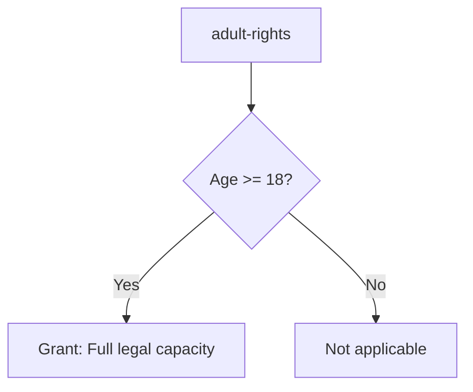

# legalis-viz

Visualization engine for legal statutes.

## Overview

`legalis-viz` provides visualization capabilities for legal documents including decision trees, flowcharts, dependency graphs, and discretionary zone highlighting.

## Features

- **Decision Trees**: Visualize eligibility determination logic
- **Dependency Graphs**: Show relationships between statutes
- **Multiple Formats**: Mermaid, GraphViz DOT, ASCII art
- **Discretion Highlighting**: Mark areas requiring human judgment

## Output Formats

| Format | Use Case |
|--------|----------|
| Mermaid | Web integration, GitHub markdown |
| GraphViz DOT | Professional diagrams, PDF export |
| ASCII Tree | Terminal display, plain text |
| ASCII Box | Compact terminal display |

## Usage

```rust
use legalis_viz::{DecisionTree, DependencyGraph, VizExporter};
use legalis_core::Statute;

// Create decision tree from statute
let statute = /* ... */;
let tree = DecisionTree::from_statute(&statute)?;

// Export to different formats
let mermaid = tree.to_mermaid();
let ascii = tree.to_ascii();

// Create dependency graph
let statutes = vec![/* ... */];
let graph = DependencyGraph::from_statutes(&statutes);
let dot = graph.to_graphviz();
```

## Mermaid Output Example



## ASCII Output Example

```
adult-rights: Adult Rights
├── Condition: Age >= 18
│   ├── [Yes] → Grant: Full legal capacity
│   └── [No] → Not applicable
└── Discretion: Consider special circumstances
```

## CLI Integration

```bash
# Generate Mermaid diagram
legalis viz input.legalis --format mermaid

# Generate ASCII tree
legalis viz input.legalis --format ascii

# Generate GraphViz DOT
legalis viz input.legalis --format dot > output.dot
dot -Tpng output.dot -o diagram.png
```

## License

MIT OR Apache-2.0
